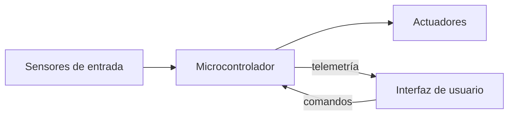

# SolarTracker

Sistema de seguimiento solar astronómico de 2 ejes con monitoreo 
energético. Calcula la posición del sol en tiempo real a partir de 
coordenadas GPS y tiempo UTC, orientando un panel fotovoltaico para 
maximizar la captación de energía.

---

## Demo

*[Video del sistema v2.1 en operación — próximamente]*

---

## Arquitectura general


---

## Variantes del sistema

### Instalación fija
Diseñado para bases estáticas. El sistema se orienta usando GPS y 
algoritmo astronómico de Meeus, con monitoreo energético comparativo 
respecto a un panel estático de referencia.

| Versión | Plataforma | Descripción |
|---|---|---|
| [v1.0](./v1/README.md) | STM32F4 | Seguimiento básico, interfaz CLI y LCD |
| [v2.0](./v2/README.md) | ESP32 | IoT con MQTT, app móvil, comparación de paneles |
| [v2.1](./v2/README.md) | ESP32 | Datalogger, monitoreo de salud industrial, interfaz SCADA |

### Plataforma móvil — v3.0 *(en desarrollo)*
Variante para bases en movimiento como rovers o embarcaciones. 
Agrega una IMU con filtro de Madgwick para corregir la orientación 
del panel compensando el movimiento de la plataforma.

---

## Estructura del repositorio
```
SolarTracker/
├── v1/                  ← firmware STM32
│   └── README.md
└── v2/                  ← firmware ESP32 + app Android
    ├── README.md
    ├── firmware/
    │   └── README.md
    └── app/
        └── README.md
```

---

## Licencia

MIT License — ver [LICENSE](./LICENSE)
