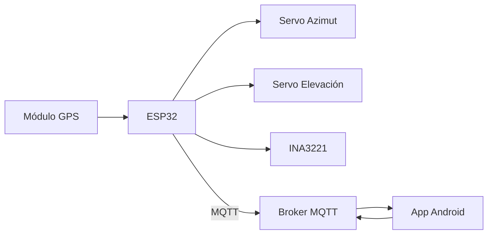

# SolarTracker

Sistema de seguimiento solar astronómico de 2 ejes con monitoreo 
energético e integración IoT. Calcula la posición del sol en tiempo 
real a partir de coordenadas GPS y tiempo UTC, orientando un panel 
fotovoltaico para maximizar la captación de energía.

---

## Demo

[Video del sistema v2.1 en operación — próximamente]

---

## Variantes del sistema

### Instalación fija — v2.1
Diseñado para instalaciones estáticas donde la base del seguidor 
no se mueve. El sistema se orienta con precisión usando GPS y 
algoritmo astronómico de Meeus, con monitoreo energético comparativo 
respecto a un panel estático de referencia.

👉 [Ver documentación completa](./v2/README.md)

### Plataforma móvil — v3.0 *(en desarrollo)*
Variante para bases en movimiento como rovers o embarcaciones. 
Agrega una IMU (GY-91) con filtro de Madgwick para corregir la 
orientación del panel en tiempo real compensando el movimiento 
de la plataforma.

👉 Documentación disponible al completar desarrollo

---

## Arquitectura general


---

## Hardware base

| Componente | Descripción |
|---|---|
| ESP32 dual-core 240 MHz | Unidad de procesamiento principal |
| 2x Servomotores | Control de azimut y elevación |
| Módulo GPS (NMEA-0183) | Geolocalización y tiempo UTC |
| INA3221 | Medición de potencia en tres canales |

---

## Historial de versiones

| Versión | Descripción |
|---|---|
| v1.0 | Implementación inicial en STM32F4, sin IoT — [ver](./v1/README.md) |
| v2.0 | Migración a ESP32, integración IoT y app móvil |
| v2.1 | Datalogger, monitoreo de salud industrial, interfaz SCADA |
| v3.0 | Plataforma móvil con IMU *(en desarrollo)* |

---

## Estructura del repositorio
```
SolarTracker/
├── v1/                  ← firmware STM32
│   └── README.md
└── v2/                  ← firmware ESP32 + app Android
    ├── README.md
    ├── firmware/
    │   └── README.md
    └── app/
        └── README.md
```

---

## Licencia

MIT License — ver [LICENSE](./LICENSE)
