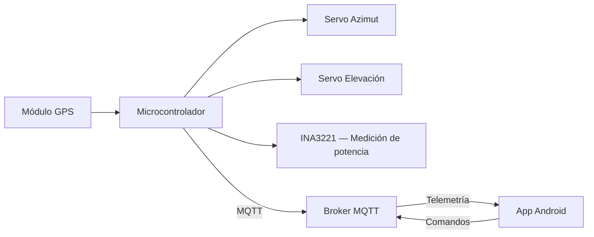

# SolarTracker

Sistema de seguimiento solar astronómico de 2 ejes con monitoreo 
energético e integración IoT. Calcula la posición del sol en tiempo 
real a partir de coordenadas GPS y tiempo UTC, orientando un panel 
fotovoltaico para maximizar la captación de energía.

---

## Demo

[Video del sistema en operación — próximamente]

---

## Evolución del proyecto

| Versión | Plataforma | Características principales |
|---|---|---|
| [v1.0](./v1/README.md) | STM32F4 | Seguimiento astronómico, GPS, control de doble eje, interfaz CLI y LCD |
| [v2.0](./v2/README.md) | ESP32 | Integración IoT con MQTT, app móvil Android, comparación seguidor vs estático |
| [v2.1](./v2/README.md) | ESP32 | Datalogger persistente, monitoreo de salud industrial, interfaz SCADA |
| v3.0 *(en desarrollo)* | ESP32 + IMU | Plataforma móvil con corrección de orientación por cuaterniones y P&O diferencial |

---

## Arquitectura general


---

## Hardware

| Componente | v1.0 | v2.x |
|---|---|---|
| Microcontrolador | STM32F411RE | ESP32 dual-core 240 MHz |
| Seguimiento | Algoritmo astronómico + GPS | Algoritmo astronómico + GPS |
| Actuadores | 2 servomotores (PWM) | 2 servomotores (PWM) |
| Medición de energía | ADC1 (corriente) | INA3221 (potencia en mW) |
| Conectividad | UART CLI | WiFi + MQTT |
| Interfaz usuario | LCD 20x4 + consola serie | App Android |

---

## Resultados

La comparación entre el panel seguidor y un panel estático de 
referencia se realiza mediante normalización polinomial que compensa 
las diferencias de respuesta entre paneles bajo las mismas condiciones 
de irradiancia.

*(Datos de ganancia pendientes — caracterización en progreso)*

---

## Estructura del repositorio
```
SolarTracker/
├── v1/                  ← firmware STM32 (seguimiento básico sin IoT)
│   └── README.md
└── v2/                  ← firmware ESP32 + app Android (IoT)
    ├── README.md        ← descripción de la versión ESP32
    ├── firmware/
    │   └── README.md    ← detalle técnico del firmware ESP32
    └── app/
        └── README.md    ← detalle técnico de la app Android
```

---

## Versiones anteriores

El historial completo de cambios está disponible en el log de Git. 
Cada subcarpeta contiene su propio README con el detalle técnico 
de esa versión.

---

## Licencia

MIT License — ver [LICENSE](./LICENSE)
