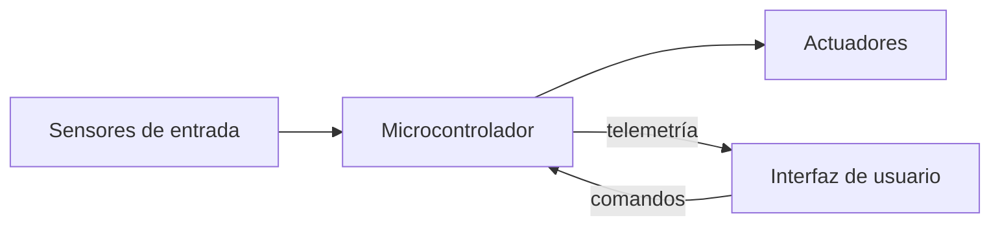

# SolarTracker

Sistema de seguimiento solar astronómico de 2 ejes con monitoreo energético. Calcula la posición del sol en tiempo real a partir de coordenadas GPS y tiempo UTC, orientando un panel fotovoltaico para maximizar la captación de energía.

---

## Versiones del proyecto

| Versión | Estado | Plataforma | Descripción | Documentación |
|---------|--------|-----------|-------------|---------------|
| [v1.0](./v1/) | ✅ Cerrada | STM32F4 | Seguimiento astronómico básico sin IoT | [README](./v1/README.md) |
| [v2.0](./v2.0/) | ✅ Cerrada | ESP32 | IoT con MQTT, app móvil Android, comparación de paneles | [README](./v2.0/README.md) |
| [v2.1](./v2.1/) | 🚧 En desarrollo | ESP32 | Datalogger, monitoreo de salud, dashboard SCADA | [README](./v2.1/README.md) |
| v3.0 | 📋 Planeada | ESP32 + IMU | Plataforma móvil con compensación de movimiento | — |

---

## Arquitectura general

**Componentes principales:**
- **MCU:** Microcontrolador principal (STM32F4 o ESP32)
- **Sensores:** GPS (coordenadas + tiempo UTC), INA3221 (monitor de potencia)
- **Actuadores:** 2 servomotores (azimut y elevación)
- **UI:** CLI/LCD (v1.0) o App Android vía MQTT (v2.x)

---

## Características según versión

### v1.0 — Base funcional
- Seguimiento astronómico usando algoritmo de Jean Meeus
- Control de 2 servos con rampas de aceleración
- Interfaz CLI vía UART + LCD 16x2
- Monitoreo básico de potencia

### v2.0 — Conectividad IoT ✅
- **Infraestructura MQTT** para comunicación bidireccional
- **App móvil Android** con visualización en tiempo real (4 Hz)
- **Comparación energética** entre panel móvil y estático
- **Normalización 1:1** de paneles (infraestructura lista para coeficientes)
- **Capturas de interfaz** documentadas

### v2.1 — Monitoreo avanzado 🚧
- Datalogger con almacenamiento de telemetría
- Dashboard SCADA para análisis histórico
- Monitoreo de salud del sistema (health metrics)
- Almacenamiento persistente en particiones ESP32

### v3.0 — Plataformas móviles 📋
- IMU con filtro de Madgwick para compensación de movimiento
- Seguimiento en rovers, embarcaciones o drones
- Algoritmo híbrido GPS + IMU

---

## Licencia

MIT License — ver [LICENSE](./LICENSE)

---

## Contacto

Para consultas o colaboraciones sobre el proyecto, abre un issue en el repositorio.
