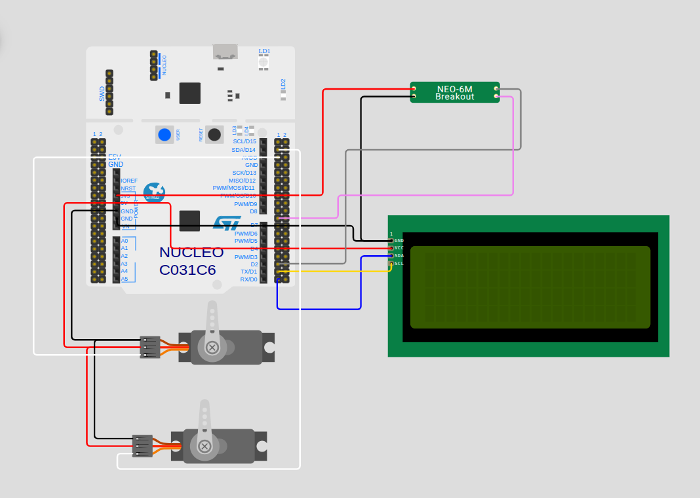

# SolarTracker v1.0

Seguidor solar astronómico de 2 ejes desarrollado sobre STM32F4. Calcula la posición del sol en tiempo real a partir de coordenadas GPS y tiempo UTC, orientando un panel fotovoltaico para maximizar la captación de energía.

Esta versión establece el núcleo de seguimiento y sirvió como base de validación del algoritmo astronómico. La v2.0 extiende el sistema con conectividad IoT, medición energética comparativa y aplicación móvil.

---

## Demo

---

## Capturas

| LCD en operación | Sistema completo |
|---|---|
| .jpeg>) |  |

| Circuito (protoboard) | Calibración de orientación |
|---|---|
| .jpeg>) |  |

---

## Hardware

| Componente | Referencia | Descripción |
|---|---|---|
| MCU | STM32F411RET6 (Nucleo-64) | Unidad de procesamiento principal — 100 MHz |
| Servomotores (×2) | — | Control de azimut y elevación |
| Módulo GPS | u-blox NEO-6M | Geolocalización y tiempo UTC — tramas NMEA-0183 |
| LCD 20×4 | HD44780 + adaptador I2C PCF8574 | Visualización local de estado y coordenadas |
| Optoacopladores (×2) | PC817 | Aislamiento galvánico entre señales PWM del MCU y servos |

---

## Diagrama de conexiones

*[Ver diagrama interactivo en Wokwi](https://wokwi.com/projects/459155510125235201)*

---

## Pinout

| Función | Pin | Periférico | Detalle |
|---|---|---|---|
| Servo azimut | PB9 | TIM11 CH1 | PWM — 500–2500 µs |
| Servo elevación | PB8 | TIM10 CH1 | PWM — 500–2500 µs |
| GPS RX | PA10 | UART1 | 9600 baud — tramas NMEA $GPRMC |
| Consola / CLI | PA2 / PA3 | UART2 + DMA | 9600 baud — TX/RX sin bloqueo |
| LCD 20x4 | PB6 / PB7 | I2C1 | Dirección 0x23 |

---

## Algoritmo de posición solar

Basado en los algoritmos de Jean Meeus (*Astronomical Algorithms*, 1998),
versión simplificada con los términos de corrección principales.

La implementación sigue ocho pasos: tiempo decimal → Día Juliano (J2000.0) → parámetros orbitales → coordenadas eclípticas → coordenadas ecuatoriales → tiempo sidéreo (GMST/LMST) → ángulo horario → coordenadas horizontales (elevación y azimut).

**Convención de azimut:** N=0°, E=90°, S=180°, O=270°.

---

## Características principales

- **Seguimiento de 360° de azimut con servos de 180°** mediante lógica de *back-flip*: cuando el sol transita por el sector norte (fuera del rango físico del servo), el sistema gira la base 180° en sentido contrario e invierte el ángulo de elevación. Cobertura hemisférica completa con hardware estándar.
- **Operación no bloqueante:** recepción y transmisión UART via DMA — el procesamiento de GPS y comandos no interrumpe el ciclo de control.
- **Persistencia ante pérdida de GPS:** el sistema continúa operando con el último fix válido hasta recuperar señal.
- **Modo simulación:** ajuste de velocidad del tiempo para validar trayectorias solares en laboratorio sin esperar el ciclo diario.
- **Interfaz CLI por consola serie:** comandos para consultar cálculos, forzar coordenadas/fecha y ajustar parámetros de simulación.

---

## Compilación

**Requisitos:** STM32CubeIDE 1.x o superior con soporte para STM32F4.

1. Abrir STM32CubeIDE
2. Importar el proyecto: `File → Open Projects from File System` → seleccionar `v1/codigo/`
3. Compilar: `Project → Build Project`
4. Flashear con ST-Link via `Run → Run`

---

## Licencia

MIT License — ver [LICENSE](../LICENSE)
