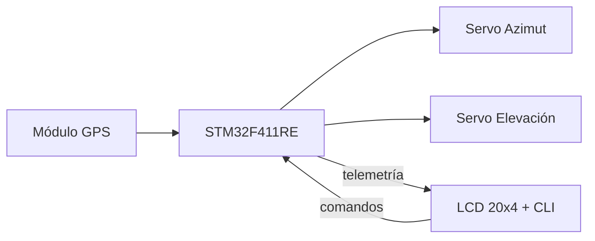

# SolarTracker v1.0 — Firmware STM32

Firmware desarrollado con STM32CubeIDE y HAL para el seguimiento 
solar astronómico de 2 ejes. Primera versión del proyecto, sin 
conectividad IoT, con interfaz local mediante LCD y consola serie.

---

## Especificaciones

| Parámetro | Valor |
|---|---|
| Microcontrolador | STM32F411RE (Nucleo-64) |
| Frecuencia de reloj | 100 MHz |
| Framework | STM32 HAL |
| Interfaz de usuario | LCD 20x4 + consola serie (CLI) |

---

## Pinout

| Función | Pin | Periférico HAL | Detalle |
|---|---|---|---|
| Servo azimut | PB9 | `htim11` — TIM11 CH1 | PWM salida |
| Servo elevación | PB8 | `htim10` — TIM10 CH1 | PWM salida |
| I2C SDA | PB7 | `hi2c1` | Bus datos — LCD 20x4 |
| I2C SCL | PB6 | `hi2c1` | Bus reloj — LCD 20x4 |
| USART1 RX | PA10 | `huart1` | Recepción GPS |
| USART1 TX | PA9 | `huart1` | Transmisión GPS (no utilizado) |
| USART2 TX | PA2 | `huart2` | Consola serie — comandos y debug |
| USART2 RX | PA3 | `huart2` | Consola serie — comandos y debug |

---

## Algoritmo de posición solar

Basado en los algoritmos de Jean Meeus (*Astronomical Algorithms*, 1998),
versión simplificada con los términos de corrección principales.
Mismo modelo implementado en la v2, ver detalle en 
[firmware v2](../v2/firmware/README.md#algoritmo-de-posición-solar).

**Precisión estimada:** ±0.2° a ±0.4°. La limitante de precisión 
del seguimiento es mecánica (±1° a ±2° con servos analógicos), 
no algorítmica.

---

## Arquitectura del sistema

### Módulos principales

### Comunicación
- Recepción GPS por USART1 mediante interrupción byte a byte
  (`HAL_UART_Receive_IT`): cada byte recibido dispara el callback,
  que acumula caracteres hasta detectar `\n` y señaliza al main
  mediante flag
- Consola serie por USART2 con DMA para comandos y debug,
  garantizando que el procesamiento de comandos no bloquee
  el ciclo principal

### Parseo GPS
- Decodificación de tramas NMEA-0183 `$GPRMC`
- Extracción de coordenadas, velocidad y tiempo UTC

### Gestión de tiempo
- Modo tiempo real: sincronizado con GPS
- Modo simulación: velocidad acelerada configurable desde CLI
  para validación de trayectorias en laboratorio

### Control de servos
- Generación de señales PWM mediante TIM10 y TIM11
- Clamping de seguridad para proteger los servos de comandos
  fuera del rango mecánico válido

### Lógica back-flip
Los servos estándar tienen un rango físico de 180°. Para lograr
cobertura completa de 360° en azimut el firmware implementa
inversión inteligente:

- **Modo estándar**: sol en sector sur (90° a 270°) — apunta directamente
- **Modo back-flip**: sol en sector norte — base rota 180° y elevación
  se invierte al ángulo suplementario

### Interfaz de usuario
- LCD 20x4 vía I2C: coordenadas solares, hora local y estado del sistema
- CLI por consola serie: consulta de datos, forzar coordenadas y fechas,
  ajuste de velocidad de simulación
---

## Rango de seguimiento

| Parámetro | Rango |
|---|---|
| Elevación | 0° a 90° — el algoritmo detecta elevación negativa (noche) y restringe el movimiento |
| Azimut | 0° a 360° — cobertura completa mediante lógica back-flip |
| Precisión de cálculo | Doble precisión (`double`) — error despreciable frente a resolución mecánica |

---

## Estado

Versión estable y funcional. Representa la base de control 
astronómico del proyecto sobre la que se construyeron las 
versiones posteriores.

**Pendiente:** monitoreo de corriente generada por el panel 
mediante ADC1.

---

## Compilación

Requiere STM32CubeIDE con el paquete STM32F4 instalado.

1. Clonar el repositorio
2. Abrir el proyecto desde `v1/` en STM32CubeIDE
3. Compilar y cargar mediante ST-Link

---

## Historial

| Versión | Descripción |
|---|---|
| v1.0 | Implementación inicial — seguimiento astronómico con GPS, CLI y LCD |
