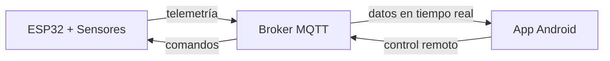

# SolarTracker v2.0

Sistema de seguimiento solar de 2 ejes con monitoreo energético comparativo e infraestructura IoT, desarrollado sobre ESP32 con ESP-IDF v5.5.

## Demo

[Video del sistema en operación — próximamente]

---

## Arquitectura del sistema

El sistema se compone de tres componentes que se comunican de forma bidireccional vía MQTT:

---

## Hardware

| Componente | Descripción |
|---|---|
| ESP32 Dual-Core 240MHz | Unidad de procesamiento principal |
| 2x Servomotores | Control de azimut y elevación |
| Módulo GPS (NMEA-0183) | Geolocalización y tiempo UTC |
| INA3221 | Medición de potencia en tres canales (mW) |

---

## Firmware

Desarrollado con ESP-IDF v5.5. El firmware implementa seguimiento astronómico basado en coordenadas GPS y fecha/hora UTC, con las siguientes características:

- Movimiento suavizado mediante rampas de aceleración en los servos
- Reconexión automática con soporte para múltiples redes WiFi
- Operación continua ante pérdida temporal de señal GPS
- Watchdog por tarea para recuperación ante bloqueos

👉 [Detalles técnicos del firmware](./codigo/esp32/README.md)

---

## App Android

La aplicación SeguidorApp permite monitoreo en tiempo real y control manual del sistema.

- Visualización de potencia instantánea y acumulada (mWh) de ambos paneles
- Ángulos actuales de azimut y elevación
- Control manual mediante joystick virtual
- Gráficas comparativas: panel seguidor vs. panel estático

👉 [Detalles técnicos de la app](./codigo/SeguidorApp/README.md)

---

## Resultados

La comparación de eficiencia entre el panel seguidor y el panel estático se realiza mediante homologación por software, compensando la diferencia de potencia nominal entre los dos paneles (factor de normalización: 1.238).

| Métrica | Valor |
|---|---|
| Ganancia promedio de energía captada | [pendiente — datos en campo] |
| Condición de medición | Día despejado, irradiancia estable |

*(Gráficas de curvas P vs R y comparación de mWh — pendiente informe técnico)*

---

## Cómo replicarlo

1. Conecta los componentes siguiendo el [pinout detallado](./codigo/esp32/README.md#pinout)
2. Compila y carga el firmware con ESP-IDF v5.5
3. Instala el APK en Android 7.0 o superior
4. Configura credenciales WiFi y MQTT en el firmware

---

## Versiones

| Versión | Descripción |
|---|---|
| v1.0 | Seguimiento astronómico básico sin IoT |
| v2.0 | Integración IoT, app móvil y comparación con panel estático |
| v3.0 | En desarrollo — corrección para plataformas móviles con IMU |
