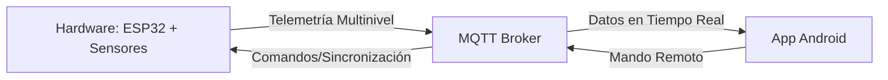

# SOLARTRACKER v2.0 - Sistema IoT de Seguimiento Solar

SolarTracker v2.0 es una plataforma de monitoreo energético y seguimiento astronómico de alta disponibilidad basada en el ESP32. Evolucionando desde la v1.0, este sistema permite maximizar la captación de energía fotovoltaica mediante algoritmos de precisión y una infraestructura IoT robusta.

## 📺 Demo en Vivo
[Aquí puedes insertar el video embebido de YouTube o un GIF animado del sistema en funcionamiento]
*El sistema muestra un movimiento suave y reactividad instantánea ante comandos remotos.*

## 🏗️ Arquitectura del Sistema
El ecosistema SolarTracker v2.0 se compone de tres pilares fundamentales que se comunican de forma bidireccional vía MQTT:

## 🛠️ Hardware Utilizado
- **Cerebro:** ESP32 Dual-Core 240MHz.
- **Actuadores:** 2 Servomotores de alto torque (Azimut y Elevación).
- **Sensores:**
    - **GPS (NMEA-0183):** Para geolocalización y tiempo UTC automático.
    - **INA3221:** Monitor de potencia de triple canal (precisión en mW).
- **Estructura:** Montura de doble eje diseñada para paneles fotovoltaicos pequeños.

## 🧠 Descripción del Firmware (ESP32)
El corazón del sistema corre sobre **ESP-IDF v5.5.3** y destaca por su **resiliencia industrial**. El firmware es capaz de recuperarse de caídas de red o fallos en los sensores sin interrumpir el seguimiento solar ni reiniciar el procesador.
- **Silky Motion:** Movimiento ultra-suave mediante rampas de aceleración.
- **Triple redundancia WiFi:** Fail-over automático entre 3 redes distintas.
- **Inercia GPS:** El sistema sigue operando incluso si pierde la señal de los satélites.

👉 [Ver detalles técnicos del Firmware](./codigo/esp32/README.md)

## 📱 Descripción de la App
La aplicación móvil (SeguidorApp) permite el monitoreo científico y el control manual total del hardware.
- **Dashboard Científico:** Visualización de potencia real, acumulados y ángulos.
- **Control Manual:** Joystick virtual para ajuste fino de la posición.
- **Análisis Comparativo:** Gráficas en tiempo real que comparan el panel seguidor vs. un panel estático.

👉 [Ver detalles técnicos de la App](./codigo/SeguidorApp/README.md)

## 📊 Resultados y Desempeño
La v2.0 integra un análisis de eficiencia comparativa real (mWh). Gracias a la homologación de paneles por software, podemos determinar la ganancia exacta del sistema de seguimiento.
- **Ganancia Promedio:** [Insertar dato, ej: +24% de energía captada].
- **Estabilidad:** Operación probada 24/7 sin bloqueos gracias al Task Watchdog coordinado.

*(Inserte aquí gráficas del informe técnico: Curvas de potencia y comparación de mWh)*

## 🚀 Cómo Replicarlo
1. **Electrónica:** Conecta los componentes siguiendo el [Pinout detallado aquí](./codigo/esp32/README.md#pinout).
2. **Firmware:** Compila y carga el código usando ESP-IDF.
3. **App:** Instala el APK en un dispositivo con Android 7.0 o superior.
4. **Configuración:** Ajusta tus credenciales WiFi y MQTT en el código del ESP32.

---
> **Nota:** Este proyecto es una herramienta de evolución tecnológica para aplicaciones de energía renovable y educación técnica. Desarrollado con el apoyo de herramientas de co-piloto IA.

