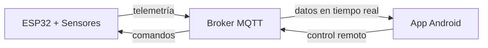

# SolarTracker v2.0

Sistema de seguimiento solar de 2 ejes con monitoreo energético comparativo e infraestructura IoT, desarrollado sobre ESP32 con ESP-IDF v5.5.

Esta versión (Resilience Edition) evoluciona a partir de la v1.0, manteniendo el núcleo de algoritmo astronómico y añadiendo conectividad IoT bidireccional, medición de energía en tiempo real y una aplicación Android para control industrial.

## Demo

*[Video del sistema en operación — próximamente]*

---

## Arquitectura del sistema

El sistema se compone de tres componentes que se comunican de forma bidireccional vía MQTT:


---

## Hardware

| Componente | Referencia | Descripción |
|---|---|---|
| MCU | ESP32-WROOM-32 | Unidad de procesamiento principal — Dual-Core 240 MHz |
| Servomotores (×2) | Tower Pro SG5010 | Control de azimut y elevación |
| Módulo GPS | u-blox NEO-6M | Geolocalización y tiempo UTC — tramas NMEA-0183 |
| Monitor de potencia | INA3221 | Medición de voltaje, corriente y potencia en 3 canales |
| Optoacopladores (×2) | PC817 | Aislamiento galvánico entre señales PWM del MCU y servos |

---

## Firmware

Desarrollado con ESP-IDF v5.5. El firmware implementa seguimiento astronómico basado en coordenadas GPS y fecha/hora UTC, con las siguientes características:

- Movimiento suavizado mediante rampas de aceleración en los servos
- Reconexión automática con soporte para múltiples redes WiFi y backoff exponencial
- Operación continua ante pérdida temporal de señal GPS con persistencia en NVS
- Watchdog por tarea para recuperación ante bloqueos
- Recuperación autónoma del bus I2C ante desconexión del INA3221
- Filtrado digital de dos etapas: promedio móvil de 5 minutos y acumulado diario
- Modo parking nocturno: los servos se posicionan a 90° cuando la elevación solar es negativa

👉 [Detalles técnicos del firmware](./codigo/esp32/README.md)

---

## App Android

La aplicación SeguidorApp ha sido rediseñada con un enfoque de instrumentación industrial, ofreciendo monitoreo en tiempo real, control directo o simulado y un sistema de autodiagnóstico:

- **Dashboard Industrial**: Tabla compacta con mediciones de voltaje, corriente y potencia, con actualizaciones rápidas a 4 Hz (sin salto visual por bypass de GC).
- **Monitoreo de Salud Inteligente**: Diagnóstico global mediante LWT (conexión, integridad de memoria NVS, periféricos GPS e I2C) con desglose en panel inferior.
- **Control híbrido**: Modos AUTO/MAN para posicionamiento manual de azimut y elevación. Suspensión temporal de telemetría automática tras un comando para evitar rebotes visuales.
- **Adquisición de calibración**: Datalogger hardware-triggered. Genera un *batch* sincronizado de 150 lecturas delta para calibración remota, exportable como CSV/.txt.

👉 [Detalles técnicos de la app](./codigo/SeguidorApp/README.md)

---

## Homologación y Calibración

Para que la comparación de eficiencia refleje únicamente la ganancia angular del seguimiento, se requiere homologar la respuesta de los paneles (que presentan distinta curva de potencia debido a sus cargas y tolerancias). 

Actualmente, el firmware incorpora una **estructura de compensación cuadrática** parametrizada:
```
P1_homologada = a·P1² + b·P1 + c
```

Para la versión 2.0, se ha optado por mantener una **relación 1:1 (a=0, b=1, c=0)** por defecto. Esto garantiza que los datos mostrados sean los reales medidos, permitiendo que en versiones posteriores (v2.1+) se inyecten los coeficientes definitivos una vez se complete la fase de caracterización experimental.

| Métrica | Estado |
|---|---|
| Modelo de homologación | Estructura cuadrática (1:1 por defecto) |
| Ganancia de energía | En medición — datos disponibles en v2.1 |
| Condición de medición | Requiere irradiancia variable (día nublado) para capturar el rango completo |

*(Las gráficas comparativas de potencia acumulada estarán disponibles en la siguiente iteración del software)*

---

## Compilación

1. Conecta los componentes siguiendo el [pinout detallado](./codigo/esp32/README.md#pinout)
2. Copia `config.example.h` como `config.h` en `codigo/esp32/main/` y completa las credenciales de red
3. Compila y carga el firmware con ESP-IDF v5.5 (`idf.py build flash monitor`)
4. Copia `Configuracion.example.java` como `Configuracion.java`, compila la app con `./gradlew assembleDebug` e instala el APK en Android 7.0+

---

## Versiones

| Versión | Descripción |
|---|---|
| v1.0 | Seguimiento astronómico básico sin IoT |
| v2.0 | Integración IoT, app móvil y comparación con panel estático |
| v2.1 | En desarrollo |
| v3.0 | En desarrollo |

---

## Licencia

MIT License — ver [LICENSE](../LICENSE)
