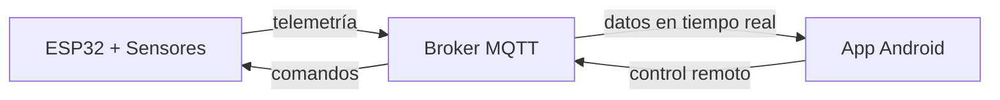

# SolarTracker v2.0

Sistema de seguimiento solar de 2 ejes con monitoreo energético comparativo e infraestructura IoT, desarrollado sobre ESP32 con ESP-IDF v5.5.

## Demo

*[Video del sistema en operación — próximamente]*

---

## Arquitectura del sistema

El sistema se compone de tres componentes que se comunican de forma bidireccional vía MQTT:


---

## Hardware

| Componente | Referencia | Descripción |
|---|---|---|
| MCU | ESP32-WROOM-32 | Unidad de procesamiento principal — Dual-Core 240 MHz |
| Servomotores (×2) | Tower Pro SG5010 | Control de azimut y elevación |
| Módulo GPS | u-blox NEO-6M | Geolocalización y tiempo UTC — tramas NMEA-0183 |
| Monitor de potencia | INA3221 | Medición de voltaje, corriente y potencia en 3 canales |
| Optoacopladores (×2) | PC817 | Aislamiento galvánico entre señales PWM del MCU y servos |

---

## Firmware

Desarrollado con ESP-IDF v5.5. El firmware implementa seguimiento astronómico basado en coordenadas GPS y fecha/hora UTC, con las siguientes características:

- Movimiento suavizado mediante rampas de aceleración en los servos
- Reconexión automática con soporte para múltiples redes WiFi y backoff exponencial
- Operación continua ante pérdida temporal de señal GPS con persistencia en NVS
- Watchdog por tarea para recuperación ante bloqueos
- Recuperación autónoma del bus I2C ante desconexión del INA3221
- Filtrado digital de dos etapas: promedio móvil de 5 minutos y acumulado diario
- Modo parking nocturno: los servos se posicionan a 90° cuando la elevación solar es negativa

👉 [Detalles técnicos del firmware](./codigo/esp32/README.md)

---

## App Android

La aplicación SeguidorApp permite monitoreo en tiempo real y control manual del sistema.

- Visualización de potencia instantánea y acumulada (mWh) de ambos paneles
- Ángulos actuales de azimut y elevación
- Control manual mediante sliders de azimut y elevación
- Comparativa de energía acumulada (mWh): panel seguidor vs. panel estático *(gráficas disponibles en v2.1)*

👉 [Detalles técnicos de la app](./codigo/SeguidorApp/README.md)

---

## Resultados

La comparación de eficiencia entre el panel seguidor y el panel estático
se realiza mediante homologación por software. Los paneles tienen respuestas
distintas ante la misma irradiancia, por lo que se caracterizó experimentalmente
la relación entre ambos y se obtuvo la siguiente curva de corrección:

```
P2_esperado = 1.0854 · P1 − 1.05
```

Esta expresión, aplicada en el firmware, permite calcular la ganancia real
del seguimiento eliminando el efecto de la disparidad entre paneles.

| Métrica | Estado |
|---|---|
| Modelo de normalización entre paneles | ✓ Obtenido (regresión lineal, R² > 0.99) |
| Ganancia promedio de energía captada | En medición — datos disponibles en v2.1 |
| Condición de medición objetivo | Día despejado, irradiancia estable |

*(Gráficas comparativas de potencia acumulada (mWh) — disponibles en v2.1)*

---

## Cómo replicarlo

1. Conecta los componentes siguiendo el [pinout detallado](./codigo/esp32/README.md#pinout)
2. Copia `config.example.h` como `config.h` en `codigo/esp32/main/` y completa las credenciales de red
3. Compila y carga el firmware con ESP-IDF v5.5 (`idf.py build flash monitor`)
4. Copia `Configuracion.example.java` como `Configuracion.java`, compila la app con `./gradlew assembleDebug` e instala el APK en Android 7.0+

---

## Versiones

| Versión | Descripción |
|---|---|
| v1.0 | Seguimiento astronómico básico sin IoT |
| v2.0 | Integración IoT, app móvil y comparación con panel estático |
| v2.1 | En desarrollo |
| v3.0 | En desarrollo |
