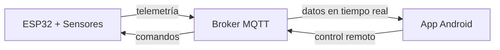
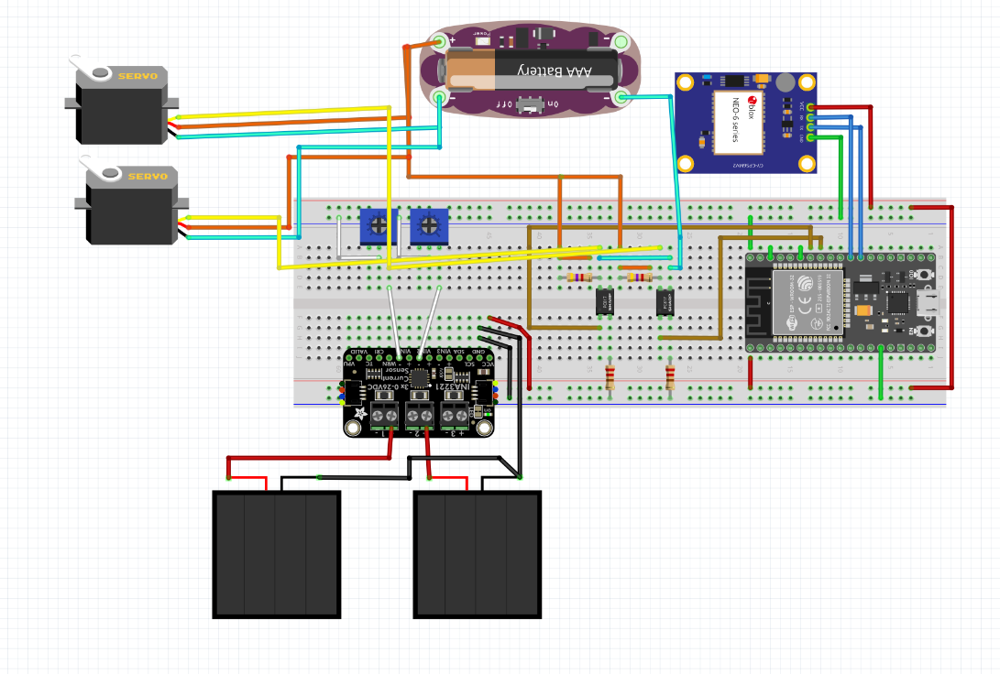
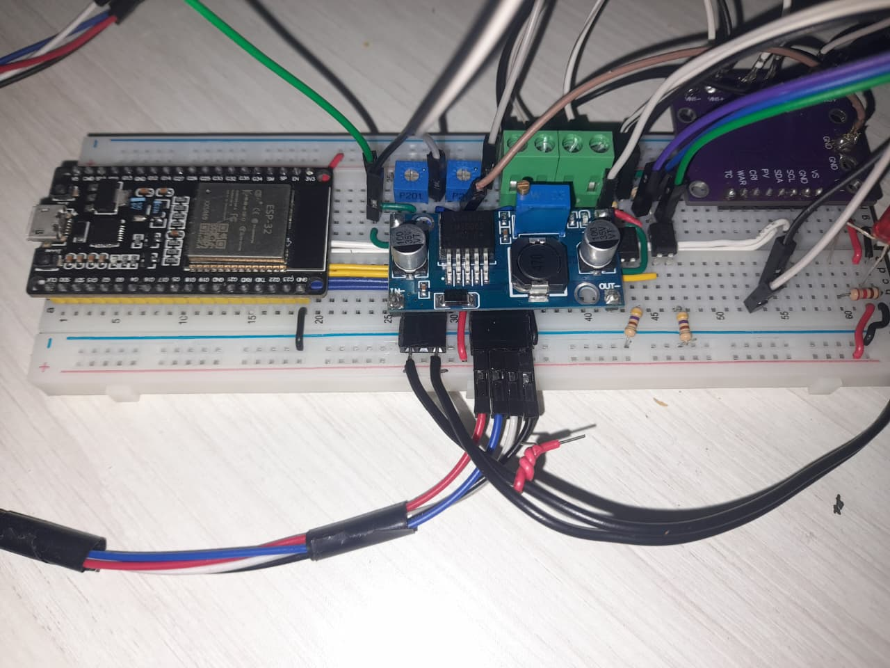
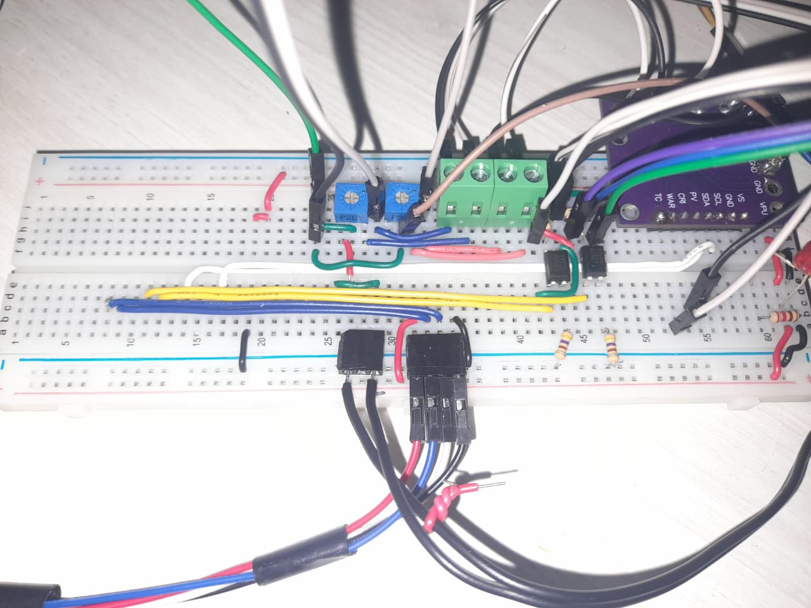

# SolarTracker v2.0

Sistema de seguimiento solar astronómico de 2 ejes con monitoreo energético comparativo e infraestructura IoT, desarrollado sobre ESP32 con ESP-IDF v5.5. Permite comparar en tiempo real la eficiencia entre un panel móvil que sigue al sol y uno estático, con visualización y control remoto vía aplicación Android.

Esta versión extiende la v1.0 con conectividad inalámbrica, telemetría sincronizada de potencia en dos canales y una app móvil para monitoreo y control.

---

## Demo

*[Video del sistema en operación — Programado para la versión estable v2.1]*

---

## Capturas

*(Las capturas de pantalla se agregarán junto con los datos de campo en v2.1)*

---

## Arquitectura del sistema

El sistema se compone de tres elementos que se comunican de forma bidireccional vía MQTT:


---

## Hardware

| Componente | Referencia | Descripción |
|---|---|---|
| MCU | ESP32-WROOM-32 | Unidad de procesamiento principal — Dual-Core 240 MHz |
| Servomotores (×2) | Tower Pro SG5010 | Control de azimut y elevación |
| Módulo GPS | u-blox NEO-6M | Geolocalización y tiempo UTC — tramas NMEA-0183 |
| Monitor de potencia | INA3221 | Medición de voltaje, corriente y potencia — 2 canales activos |
| Optoacopladores (×2) | PC817 | Aislamiento galvánico entre señales PWM del MCU y servos |

---

## Diagrama de conexiones


> **Nota:** El archivo original editable de Fritzing (`v2.0.fzz`) y las fotografías del hardware se encuentran en el directorio [`/hardware`](./hardware).

### Montaje físico (Prototipo)

<p align="center">
  
  
</p>

*Desarrollo sobre protoboard: Izquierda: Integración de la etapa de alimentación (Buck LM2596), MCU (ESP32) y sensor de potencia (INA3221). Derecha: Cableado base mostrando la fase de optoacoplamiento (PC817) para el control PWM de los servomotores.*

---

## Pinout

| Función | GPIO | Detalle |
|---|---|---|
| Servo azimut | 19 | PWM — LEDC canal 0 |
| Servo elevación | 18 | PWM — LEDC canal 1 |
| GPS TX | 16 | UART2 — no utilizado |
| GPS RX | 17 | UART2 — 9600 baud |
| I2C SDA | 21 | Bus datos — INA3221 |
| I2C SCL | 22 | Bus reloj — INA3221 |

---

## Algoritmo de posición solar

Basado en los algoritmos de Jean Meeus (*Astronomical Algorithms*, 1998),
versión simplificada con los términos de corrección principales.

La implementación sigue ocho pasos: tiempo decimal → Día Juliano (J2000.0) → parámetros orbitales → coordenadas eclípticas → coordenadas ecuatoriales → tiempo sidéreo (GMST/LMST) → ángulo horario → coordenadas horizontales (elevación y azimut).

**Convención de azimut:** N=0°, E=90°, S=180°, O=270°.

**Precisión estimada:** ±0.2° a ±0.4°. La limitante de precisión del seguimiento es mecánica (servos analógicos ±1° a ±2°), no algorítmica.

---

## Características principales

### Firmware ESP32

- **Seguimiento astronómico de alta precisión** con cálculo continuo de posición solar en tiempo real usando coordenadas GPS y reloj UTC.
- **Movimiento suavizado mediante rampas de aceleración** limitadas a 15°/s para proteger la mecánica de los servos y evitar vibraciones.
- **Reconexión automática con backoff exponencial** — soporte para múltiples redes WiFi (hasta 3) con reintentos inteligentes de 2s a 64s, asegurando conectividad continua.
- **Operación continua ante pérdida de GPS** — el sistema persiste las últimas coordenadas válidas en memoria NVS (Non-Volatile Storage) y continúa el seguimiento con el último fix hasta recuperar señal.
- **Watchdog por tarea (TWDT)** — cada tarea crítica (GPS, INA, principal) reporta actividad; ante bloqueos, el sistema se reinicia automáticamente sin intervención manual.
- **Recuperación autónoma del bus I2C** — ante desconexión del INA3221, el firmware reinicializa el bus sin comprometer la operación de seguimiento.
- **Filtrado digital de dos etapas:**
  - **Promedio móvil de 5 minutos** mediante buffer circular para suavizar variaciones rápidas por nubosidad.
  - **Energía acumulada diaria (mWh)** con integración continua, reinicio automático al inicio de cada jornada.
- **Modo parking nocturno automático** — cuando la elevación solar es negativa (sol bajo el horizonte), los servos se posicionan a 90° para proteger el panel.
- **Modo búsqueda inicial** — al arrancar sin coordenadas GPS, los servos barren en azimut (45° cada 10 segundos) para evitar posiciones indefinidas hasta obtener fix.
- **Arquitectura FreeRTOS multiproceso** — todas las tareas de control corren en Core 1, aisladas del stack WiFi/BT (Core 0), eliminando picos de latencia por tráfico de red.
- **Sincronización eficiente con doble buffer ping-pong** — el parseo GPS no copia cadenas NMEA completas entre tareas; solo transfiere índices del buffer recién llenado.
- **Control de posición dual:**
  - **Modo AUTO:** seguimiento solar automático con datos GPS en tiempo real.
  - **Modo MANUAL:** control directo de azimut y elevación mediante comandos MQTT desde la app.
- **Modo simulación de tiempo** — ajuste de velocidad del reloj interno (factor 1x a 1440x) para validar trayectorias solares aceleradas. Permite simular 1 día completo en 1 minuto.

👉 [Detalles técnicos del firmware](./codigo/esp32/README.md)

---

## App Android

La aplicación **SeguidorApp** permite monitoreo en tiempo real y control remoto del seguidor, con visualización de telemetría a 4 Hz y adquisición de datos para calibración.

### Funcionalidades principales

- **Tabla de telemetría en tiempo real** — Visualización compacta de potencia instantánea, promedio y energía acumulada para 2 paneles, con actualizaciones fluidas a 4 Hz sin saltos visuales (bypass de Garbage Collector mediante parsing directo sin JSON).
- **Cálculo de ganancia energética** — Comparación porcentual en tiempo real entre la energía acumulada del panel móvil y el estático.
- **Medidores analógicos (Gauges)** — Visualización de ángulos solares (azimut/elevación) y posición de servos con representación tipo instrumentación analógica.
- **Control remoto de posición:**
  - Sliders para ajuste manual de azimut (-90° a +90°) y elevación (0° a 180°).
  - Suspensión temporal de actualizaciones automáticas por 3 segundos tras un comando manual para evitar rebotes visuales antes de que el hardware responda.
- **Control de coordenadas y tiempo:**
  - Ajuste manual de latitud y longitud para pruebas sin mover el hardware.
  - Factor de velocidad de simulación (1x a 1440x) mediante slider circular — permite simular 1 día completo en 1 minuto.
  - Botón "VOLVER A GPS" para restaurar el modo automático con coordenadas reales.
- **Adquisición de datos para calibración:**
  - Botón "DESCARGAR" que solicita al ESP32 un batch sincronizado de 150 muestras delta de potencia.
  - Exportación a archivo CSV con timestamp mediante botón "COMPARTIR".
  - Permite análisis externo de correlación entre paneles para determinar coeficientes de normalización y realizar comparaciones de rendimiento.

### Arquitectura de software

Patrón **MVC (Modelo-Vista-Controlador)** con separación estricta entre comunicaciones, procesamiento de datos y capa de presentación:

```
SeguidorApp/
├── comunicaciones/
│   └── ClientePubSubMQTT.java     ← cliente MQTT asíncrono con cola concurrente
├── datos/
│   ├── AlmacenDatosRAM.java       ← estado global compartido entre capas (volatile)
│   └── ProcesadorTelemetria.java  ← parsing de telemetría optimizado para 4 Hz
├── utilidades/
│   ├── GeneradorUI.java           ← componentes visuales aislados de la lógica
│   ├── GaugeSimple.java           ← medidor analógico con renderizado en Canvas
│   ├── CircularSlider.java        ← control circular para factor de simulación
│   ├── Boton.java                 ← botones personalizados
│   └── DialogoSalir.java          ← confirmación de salida
└── ActividadSeguidor.java         ← coordinación general y ciclo de vida
```

**Decisiones de diseño relevantes:**

- **Parsing sin JSON para canal rápido (4 Hz):** evita presión sobre el Garbage Collector, reduciendo saltos visuales en la tabla.
- **Cola concurrente en MQTT:** publicación y recepción en hilo separado, sin bloquear el UI Thread.
- **Bloqueo post-intervención manual:** suspende actualizaciones automáticas por 3 segundos tras un comando para evitar sobreescritura visual prematura.
- **GeneradorUI desacoplado:** permite modificar la interfaz sin tocar comunicaciones ni procesamiento de datos.
- **Variables volatile en AlmacenDatosRAM:** garantiza visibilidad entre el hilo MQTT y el UI Thread.

👉 [Detalles técnicos de la app](./codigo/SeguidorApp/README.md)

---

## Resultados y Calibración

Para que la comparación de eficiencia refleje únicamente la ganancia angular del seguimiento, se requiere normalizar la respuesta de los paneles (que pueden tener cargas o eficiencias distintas).

### Punto óptimo de operación

Cada panel opera con una resistencia de carga fija correspondiente a su punto de máxima potencia (MPP), determinada experimentalmente mediante barrido de resistencia:

| Panel | Potencia MPP | Resistencia de carga |
|---|---|---|
| Estático | 520 mW | 40.2 Ω |
| Seguidor | 420 mW | 56 Ω |

### Modelo de corrección cuadrático

Actualmente, el firmware incorpora una **estructura de corrección cuadrática** parametrizada:
```
P1_norm = a·P1² + b·P1 + c
```

**Estado actual (v2.0):** Se ha configurado una **relación 1:1 (a=0, b=1, c=0)** por defecto. Esto garantiza:
1. Visualizar los datos reales medidos sin procesamientos experimentales previos.
2. Contar con una infraestructura lista para inyectar coeficientes precisos una vez se complete la caracterización definitiva en campo.

Esta expresión permitirá calcular la ganancia real del seguimiento en versiones futuras:
```
ganancia = (P1_norm − P2_real) / P2_real × 100%
```

| Métrica | Estado |
|---|---|
| Modelo de normalización | Estructura cuadrática implementada (1:1 por defecto) |
| Ganancia de energía | En medición — datos disponibles en v2.1 |
| Condición de medición | Pendiente de validación con irradiancia variable |

---

## Compilación

### Firmware ESP32

**Requisitos:** ESP-IDF v5.5.3 instalado y configurado en el sistema.

```bash
cd v2/codigo/esp32

# 1. Configurar credenciales de red (solo la primera vez)
cp main/config.example.h main/config.h
# Editar main/config.h con el SSID, contraseña WiFi y datos del broker MQTT

# 2. Configurar el target (solo la primera vez)
idf.py set-target esp32

# 3. Compilar
idf.py build

# 4. Flashear y monitorear (ajustar el puerto según el sistema)
#    Linux/macOS: /dev/ttyUSB0 o /dev/ttyACM0
#    Windows:     COM3, COM4, etc.
idf.py -p /dev/ttyUSB0 flash monitor
```

Al iniciar, el sistema espera fix GPS (log `[GPS] Fix válido`). Una vez adquirido, el seguimiento astronómico arranca automáticamente.

### App Android

**Requisitos:** Android Studio Koala o superior, JDK 17, Android SDK API 24+.

```bash
cd v2/codigo/SeguidorApp

# 1. Configurar credenciales del broker MQTT (solo la primera vez)
cp app/src/main/java/com/solartracker/Configuracion.example.java \
   app/src/main/java/com/solartracker/Configuracion.java
# Editar Configuracion.java con la IP/dominio del broker y las credenciales

# 2. Compilar y generar APK de debug
./gradlew assembleDebug

# El APK queda en: app/build/outputs/apk/debug/app-debug.apk
```

También se puede abrir el proyecto directamente en Android Studio y ejecutar con `Run ▶` sobre un dispositivo o emulador con Android 7.0+.

---

## Versiones

| Versión | Descripción |
|---|---|
| v1.0 | Seguimiento astronómico básico sin IoT |
| v2.0 | Integración IoT, app móvil y comparación con panel estático |
| v2.1 | En desarrollo |
| v3.0 | En desarrollo |

---

## Licencia

MIT License — ver [LICENSE](../LICENSE)
