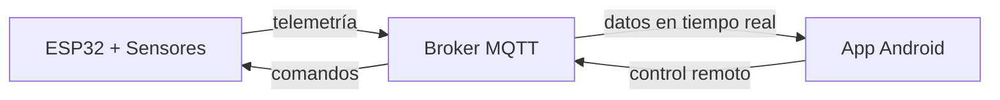

# SolarTracker v2.0

Sistema de seguimiento solar astronómico de 2 ejes con monitoreo energético comparativo e infraestructura IoT, desarrollado sobre ESP32 con ESP-IDF v5.5. Permite comparar en tiempo real la eficiencia entre un panel móvil que sigue al sol y uno estático, con visualización y control remoto vía aplicación Android.

Esta versión extiende la v1.0 con conectividad inalámbrica, telemetría sincronizada de potencia en tres canales y una app móvil de instrumentación industrial.

---

## Demo

*[Video del sistema en operación — próximamente]*

---

## Capturas

*(Las capturas de pantalla se agregarán junto con los datos de campo en v2.1)*

---

## Arquitectura del sistema

El sistema se compone de tres componentes que se comunican de forma bidireccional vía MQTT:


---

## Hardware

| Componente | Referencia | Descripción |
|---|---|---|
| MCU | ESP32-WROOM-32 | Unidad de procesamiento principal — Dual-Core 240 MHz |
| Servomotores (×2) | Tower Pro SG5010 | Control de azimut y elevación |
| Módulo GPS | u-blox NEO-6M | Geolocalización y tiempo UTC — tramas NMEA-0183 |
| Monitor de potencia | INA3221 | Medición de voltaje, corriente y potencia en 3 canales |
| Optoacopladores (×2) | PC817 | Aislamiento galvánico entre señales PWM del MCU y servos |

---

## Diagrama de conexiones

*[Diagrama de conexiones disponible en v2.1]*

---

## Pinout

| Función | GPIO | Detalle |
|---|---|---|
| Servo azimut | 19 | PWM — LEDC canal 0 |
| Servo elevación | 18 | PWM — LEDC canal 1 |
| GPS RX | 17 | UART2 — 9600 baud |
| GPS TX | 16 | UART2 — no utilizado |
| I2C SDA | 21 | Bus datos — INA3221 |
| I2C SCL | 22 | Bus reloj — INA3221 |

---

## Algoritmo de posición solar

Basado en los algoritmos de Jean Meeus (*Astronomical Algorithms*, 1998),
versión simplificada con los términos de corrección principales.

La implementación sigue ocho pasos: tiempo decimal → Día Juliano (J2000.0) → parámetros orbitales → coordenadas eclípticas → coordenadas ecuatoriales → tiempo sidéreo (GMST/LMST) → ángulo horario → coordenadas horizontales (elevación y azimut).

**Convención de azimut:** N=0°, E=90°, S=180°, O=270°.

**Precisión estimada:** ±0.2° a ±0.4°. La limitante de precisión del seguimiento es mecánica (servos analógicos ±1° a ±2°), no algorítmica.

---

## Características principales

### Firmware ESP32

- **Seguimiento astronómico de alta precisión** con cálculo continuo de posición solar en tiempo real usando coordenadas GPS y reloj UTC.
- **Movimiento suavizado mediante rampas de aceleración** limitadas a 15°/s para proteger la mecánica de los servos y evitar vibraciones.
- **Reconexión automática con backoff exponencial** — soporte para múltiples redes WiFi (hasta 3) con reintentos inteligentes de 2s a 64s, asegurando conectividad continua.
- **Operación continua ante pérdida de GPS** — el sistema persiste las últimas coordenadas válidas en memoria NVS (Non-Volatile Storage) y continúa el seguimiento con el último fix hasta recuperar señal.
- **Watchdog por tarea (TWDT)** — cada tarea crítica (GPS, INA, principal) reporta actividad; ante bloqueos, el sistema se reinicia automáticamente sin intervención manual.
- **Recuperación autónoma del bus I2C** — ante desconexión del INA3221, el firmware reinicializa el bus sin comprometer la operación de seguimiento.
- **Filtrado digital de dos etapas:**
  - **Promedio móvil de 5 minutos** mediante buffer circular para suavizar variaciones rápidas por nubosidad.
  - **Energía acumulada diaria (mWh)** con integración continua, reinicio automático al inicio de cada jornada.
- **Modo parking nocturno automático** — cuando la elevación solar es negativa (sol bajo el horizonte), los servos se posicionan a 90° para proteger el panel.
- **Modo búsqueda inicial** — al arrancar sin coordenadas GPS, los servos barren lentamente en azimut para evitar posiciones indefinidas hasta obtener fix.
- **Arquitectura FreeRTOS multiproceso** — todas las tareas de control corren en Core 1, aisladas del stack WiFi/BT (Core 0), eliminando picos de latencia por tráfico de red.
- **Sincronización eficiente con doble buffer ping-pong** — el parseo GPS no copia cadenas NMEA completas entre tareas; solo transfiere índices del buffer recién llenado.
- **Control de posición dual:**
  - **Modo AUTO:** seguimiento solar automático con datos GPS en tiempo real.
  - **Modo MANUAL:** control directo de azimut y elevación mediante comandos MQTT desde la app.
- **Modo simulación de tiempo** — ajuste de velocidad del reloj interno (factor 1x a 3600x) para validar trayectorias solares sin esperar el ciclo diario.

👉 [Detalles técnicos del firmware](./codigo/esp32/README.md)

---

## App Android

La aplicación **SeguidorApp** ha sido desarrollada con un enfoque de instrumentación industrial, ofreciendo monitoreo en tiempo real, control híbrido (AUTO/MAN), sistema de autodiagnóstico y adquisición de datos para calibración.

### Funcionalidades principales

- **Dashboard Industrial** — Tabla compacta con mediciones de voltaje, corriente y potencia para 2 paneles, con actualizaciones fluidas a 4 Hz sin salto visual (bypass de Garbage Collector mediante parsing directo sin JSON).
- **Monitoreo de Salud Inteligente mediante LWT** — Sistema de semáforo global (verde/amarillo/rojo) y panel detallado con desglose de estado: conexión, integridad de memoria NVS, periféricos GPS e I2C INA3221.
- **Control híbrido AUTO/MAN:**
  - **Modo AUTO:** el firmware sigue automáticamente al sol con coordenadas GPS.
  - **Modo MAN:** control remoto directo de azimut y elevación mediante sliders en la app.
  - Suspensión temporal de telemetría automática tras un comando manual (3 segundos) para evitar rebotes visuales antes de que el hardware responda.
- **Adquisición de datos para calibración** — Datalogger asíncrono activado por hardware que genera un *batch* sincronizado de 150 lecturas delta, exportable como CSV/.txt para análisis de correlación entre paneles.
- **Visualización de energía acumulada** — Gráficos comparativos de energía diaria (mWh) para evaluar la ganancia real del seguimiento.
- **Geolocalización y control de tiempo** — Visualización de coordenadas GPS en tiempo real, ajuste manual de fecha y factor de velocidad para simulación de trayectorias solares.
- **Medidores analógicos (Gauges)** — Representación visual tipo instrumentación de aviación con buffer circular para suavizado de lecturas ruidosas.

### Arquitectura de software

Patrón **MVC (Modelo-Vista-Controlador)** con separación estricta entre comunicaciones, procesamiento de datos y capa de presentación:

```
SeguidorApp/
├── comunicaciones/
│   └── ClientePubSubMQTT.java     ← cliente MQTT asíncrono con cola concurrente
├── datos/
│   ├── AlmacenDatosRAM.java       ← estado global compartido entre capas (volatile)
│   └── ProcesadorTelemetria.java  ← parsing de telemetría optimizado para 4 Hz
├── utilidades/
│   ├── GeneradorUI.java           ← componentes visuales aislados de la lógica
│   ├── GaugeSimple.java           ← medidor analógico con renderizado en Canvas
│   ├── CircularSlider.java        ← control circular para factor de simulación
│   └── DialogoSalir.java          ← confirmación de salida
└── ActividadSeguidor.java         ← coordinación general y ciclo de vida
```

**Decisiones de diseño relevantes:**

- **Parsing sin JSON:** evita presión sobre el Garbage Collector a 4 Hz, reduciendo saltos visuales en la tabla.
- **Cola concurrente en MQTT:** publicación y recepción en hilo separado, sin bloquear el UI Thread.
- **Bloqueo post-intervención manual:** suspende actualizaciones automáticas por 3 segundos tras un comando para evitar sobreescritura visual prematura.
- **GeneradorUI desacoplado:** permite modificar la interfaz sin tocar comunicaciones ni procesamiento de datos.

👉 [Detalles técnicos de la app](./codigo/SeguidorApp/README.md)

---

## Resultados y Calibración

Para que la comparación de eficiencia refleje únicamente la ganancia angular del seguimiento, se requiere normalizar la respuesta de los paneles (que pueden tener cargas o eficiencias distintas).

### Punto óptimo de operación

Cada panel opera con una resistencia de carga fija correspondiente a su punto de máxima potencia (MPP), determinada experimentalmente mediante barrido de resistencia:

| Panel | Potencia MPP | Resistencia de carga |
|---|---|---|
| Estático | 520 mW | 40.2 Ω |
| Seguidor | 420 mW | 56 Ω |

### Modelo de corrección cuadrático

Actualmente, el firmware incorpora una **estructura de corrección cuadrática** parametrizada:
```
P1_norm = a·P1² + b·P1 + c
```

**Estado actual (v2.0):** Se ha configurado una **relación 1:1 (a=0, b=1, c=0)** por defecto. Esto garantiza:
1. Visualizar los datos reales medidos sin procesamientos experimentales previos.
2. Contar con una infraestructura lista para inyectar coeficientes precisos una vez se complete la caracterización definitiva en campo.

Esta expresión permitirá calcular la ganancia real del seguimiento en versiones futuras:
```
ganancia = (P1_norm − P2_real) / P2_real × 100%
```

| Métrica | Estado |
|---|---|
| Modelo de normalización | Estructura cuadrática implementada (1:1 por defecto) |
| Ganancia de energía | En medición — datos disponibles en v2.1 |
| Condición de medición | Pendiente de validación con irradiancia estable |

*(Las gráficas comparativas de potencia acumulada estarán disponibles en la siguiente iteración del software)*

---

## Compilación

### Firmware ESP32

**Requisitos:** ESP-IDF v5.5.3 instalado y configurado en el sistema.

```bash
cd v2/codigo/esp32

# 1. Configurar credenciales de red (solo la primera vez)
cp main/config.example.h main/config.h
# Editar main/config.h con el SSID, contraseña WiFi y datos del broker MQTT

# 2. Configurar el target (solo la primera vez)
idf.py set-target esp32

# 3. Compilar
idf.py build

# 4. Flashear y monitorear (ajustar el puerto según el sistema)
#    Linux/macOS: /dev/ttyUSB0 o /dev/ttyACM0
#    Windows:     COM3, COM4, etc.
idf.py -p /dev/ttyUSB0 flash monitor
```

Al iniciar, el sistema espera fix GPS (log `[GPS] Fix válido`). Una vez adquirido, el seguimiento astronómico arranca automáticamente.

### App Android

**Requisitos:** Android Studio Koala o superior, JDK 17, Android SDK API 24+.

```bash
cd v2/codigo/SeguidorApp

# 1. Configurar credenciales del broker MQTT (solo la primera vez)
cp app/src/main/java/com/solartracker/Configuracion.example.java \
   app/src/main/java/com/solartracker/Configuracion.java
# Editar Configuracion.java con la IP/dominio del broker y las credenciales

# 2. Compilar y generar APK de debug
./gradlew assembleDebug

# El APK queda en: app/build/outputs/apk/debug/app-debug.apk
```

También se puede abrir el proyecto directamente en Android Studio y ejecutar con `Run ▶` sobre un dispositivo o emulador con Android 7.0+.

---

## Versiones

| Versión | Descripción |
|---|---|
| v1.0 | Seguimiento astronómico básico sin IoT |
| v2.0 | Integración IoT, app móvil y comparación con panel estático |
| v2.1 | En desarrollo |
| v3.0 | En desarrollo |

---

## Licencia

MIT License — ver [LICENSE](../LICENSE)
