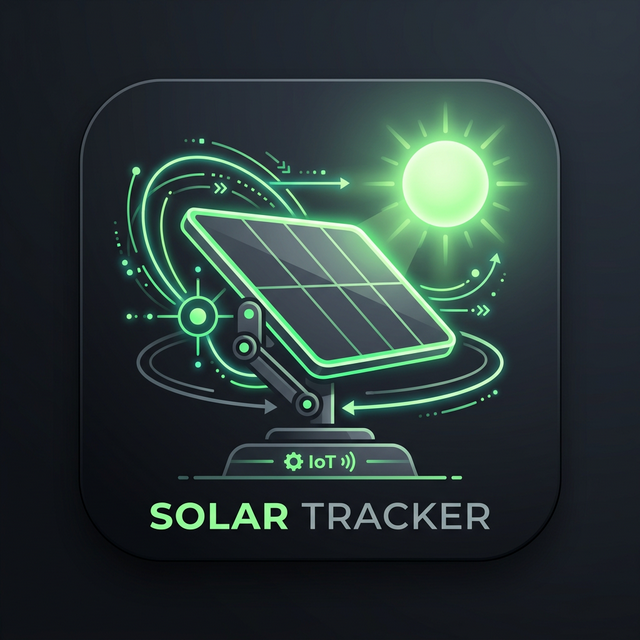

# Arquitectura de la App Móvil (SeguidorApp)

<p align="center">
  
</p>

La versión móvil de **SolarTracker Pro** (v2.0) ha sido diseñada siguiendo estrictamente las mejores prácticas para aplicaciones de monitoreo del Internet de las Cosas (IoT). Su código fuente fue escrito implementando el patrón de arquitectura **MVC (Modelo-Vista-Controlador)** con **Responsabilidad Única**.

Esto significa que, a diferencia de diseños monolíticos, cada componente del código tiene un rol específico e intransferible, garantizando que el mantenimiento sea predictivo y el rendimiento de la batería sea óptimo. 

## Diagrama de Flujo y Componentes

```mermaid
graph TD;
    Red((Red WiFi/Datos)) -- MQTT 5Hz --> ClientePubSubMQTT;

    subgraph Paquete: Comunicaciones
        ClientePubSubMQTT[ClientePubSubMQTT] -- "Agrega String a la Cola" --> Buffer[Cola de Mensajes Concurrentes];
    end

    subgraph Controlador
        ActividadSeguidor[ActividadSeguidor (Main Thread)] 
    end

    Buffer -- "Hilo Secundario\n (run loop de 50ms)" --> ActividadSeguidor;

    subgraph Paquete: Datos
        ActividadSeguidor -- "Extraer Fast/Slow" --> ProcesadorTelemetria[ProcesadorTelemetria (Parser)];
        ProcesadorTelemetria -- "Actualiza Variables" --> AlmacenDatosRAM[(AlmacenDatosRAM)];
    end

    subgraph Paquete: Utilidades
        GeneradorUI[GeneradorUI (Vista)]
    end

    ActividadSeguidor -- "Lee estados para UI" --> AlmacenDatosRAM;
    ActividadSeguidor -- "Notifica a la Vista" --> GeneradorUI;
    GeneradorUI -.->|"Eventos del\n Usuario (Sliders/Botones)"| ActividadSeguidor;
    ActividadSeguidor -- "Publicar Comandos" --> ClientePubSubMQTT;
    ClientePubSubMQTT -- MQTT --> Red;
```

## Beneficios del Diseño Actual

1. **Evitación de Objetos Basura (Garbage Collector Bypass):** Android usa máquinas virtuales Java limitadas. Al recibir telemetría "Fast" a `5 Hz`, la instanciación de clases `JSONObject` saturaría la RAM induciendo caídas de *framerate* constantes. La clase **`ProcesadorTelemetria`** elude el mapeo JSON leyendo el valor de punto flotante directamente desde el buffer de entrada como texto puro, logrando el consumo óptimo.

2. **UI Reactiva:** La clase **`ActividadSeguidor`** hospeda el lazo principal. Cuando hay intervención manual del operador (tocar los controles `sliders`), el sistema implementa una pausa inteligente de bloqueo sobre esos parámetros. En otras palabras, "desacopla" los motores y no forzará la retroalimentación de la UI hasta que hayan transcurrido 3000 milisegundos de inactividad humana.

3. **Inercias y Promedios Móviles:** Las métricas de promedio de potencia que muestran los medidores ("gauges") se calculan con un _Buffer Circular_. Esto lo maneja individualmente la clase `ProcesadorTelemetria`, la cual garantiza que el promedio mantenga una media asíncrona real basada en un histórico de las medidas que entran, logrando que sea sumamente fluido verlo en la pantalla sin estrés en el sistema.

4. **Componentización de la Vista:** `GeneradorUI` separa enteramente la declaración y estilización de colores, tipografías y `LinearLayout`. Si el día de mañana deseas migrar esta versión a, por ejemplo, Jetpack Compose o simplemente rediseñar por temas o pantallas, sólo la clase GeneradorUI recibirá los cambios.
